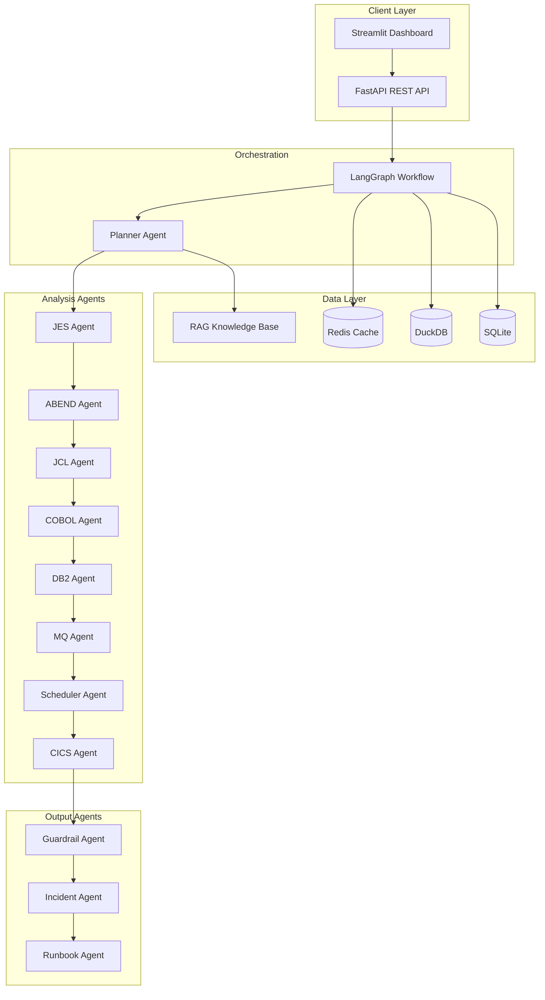
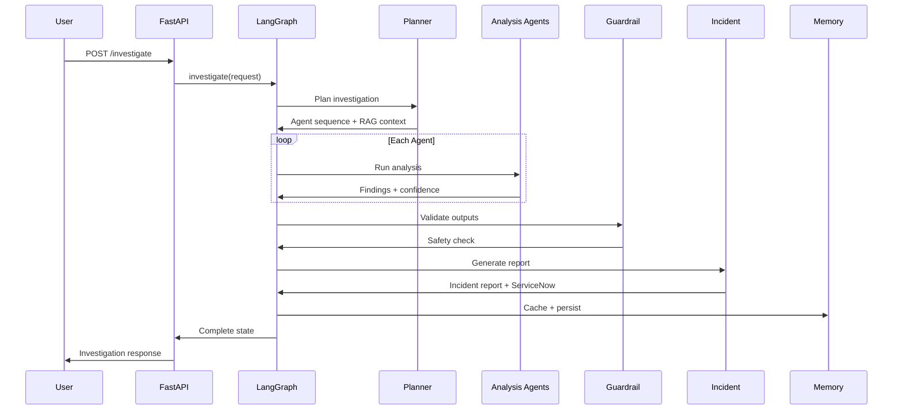

# Mainframe AI Operations Copilot

Enterprise-grade AI-powered Mainframe Operations Copilot for autonomous production incident investigation. Built with LangGraph multi-agent architecture, FastAPI, and production observability.

## Features

- **Multi-Agent Investigation**: 11 specialized agents (JES, ABEND, JCL, COBOL, DB2, MQ, CICS, Scheduler, Guardrail, Incident, Runbook)
- **LangGraph Orchestration**: Sequential agent pipeline with state management
- **RAG Knowledge Base**: FAISS/Chroma vector search over operational manuals and runbooks
- **Guardrails**: PII masking, prompt injection detection, hallucination risk scoring, human approval gates
- **Streamlit Dashboard**: Upload artifacts, run investigations, visualize results
- **Observability**: OpenTelemetry tracing, Prometheus metrics, Grafana dashboards
- **100+ Test Cases**: Unit, integration, agent, and performance tests

## Architecture



## Sequence Diagram



## Quick Start

> 📖 **Full walkthrough:** [Step-by-Step Guide & Video Script](docs/STEP-BY-STEP-GUIDE.md) | [Video Storyboard](docs/VIDEO-STORYBOARD.md)

### Prerequisites

- Python 3.13+
- Docker & Docker Compose (optional)
- OpenAI API key (optional — rule-based fallback available)

### Local Development

```bash
cd mainframe-ai-copilot
python -m venv .venv
source .venv/bin/activate
pip install -r requirements.txt
cp .env.example .env

# Generate sample data
python scripts/generate_sample_data.py

# Start API
uvicorn main:app --reload --port 8000

# Start Dashboard (separate terminal)
streamlit run dashboard/app.py
```

### Docker Deployment

```bash
docker-compose up -d
```

| Service | URL |
|---------|-----|
| API | http://localhost:8000 |
| Swagger Docs | http://localhost:8000/docs |
| Dashboard | http://localhost:8501 |
| Prometheus | http://localhost:9090 |
| Grafana | http://localhost:3000 |

## API Endpoints

| Method | Endpoint | Description |
|--------|----------|-------------|
| GET | `/health` | Health check |
| POST | `/api/v1/investigate` | Run AI investigation |
| POST | `/api/v1/investigate/upload` | Upload files and investigate |
| GET | `/api/v1/history` | Investigation history |
| GET | `/api/v1/knowledge/search` | RAG knowledge search |

### Example Request

```bash
curl -X POST http://localhost:8000/api/v1/investigate \
  -H "Content-Type: application/json" \
  -d '{
    "job_name": "CLMDAY01",
    "application": "Claims Processing",
    "description": "Claims batch failed with S0C7",
    "jes_log": "IEF450I CLMDAY01 - ABEND CODE=S0C7",
    "abend_log": "ABEND CODE: S0C7 PROGRAM PGMCLM01"
  }'
```

## Project Structure

```
mainframe-ai-copilot/
├── agents/           # Specialized analysis agents
├── graph/            # LangGraph workflow
├── rag/              # RAG knowledge base
├── models/           # Pydantic data models
├── utils/            # Parsers, LLM, PII masking
├── knowledge/        # Operational manuals & runbooks
├── logs/             # Sample log files
├── sample_data/      # COBOL, JCL samples
├── dashboard/        # Streamlit UI
├── tests/            # 100+ pytest tests
├── monitoring/       # Prometheus, OTEL config
├── prompts/          # LLM prompt templates
├── scripts/          # Data generation
├── main.py           # FastAPI application
├── config.py         # Configuration
├── docker-compose.yml
└── requirements.txt
```

## Agent Pipeline

```
Planner → JES → ABEND → JCL → COBOL → DB2 → MQ → Scheduler → CICS
  → Guardrail → Incident Summary → Runbook Recommendation
```

## Configuration

See `.env.example` for all settings:

| Variable | Default | Description |
|----------|---------|-------------|
| `OPENAI_API_KEY` | — | OpenAI API key for GPT-4.1 |
| `OPENAI_MODEL` | gpt-4.1 | LLM model |
| `REDIS_URL` | redis://localhost:6379/0 | Redis cache |
| `CONFIDENCE_THRESHOLD` | 0.65 | Minimum confidence score |
| `REQUIRE_HUMAN_APPROVAL_FOR_RESTART` | true | Restart approval gate |
| `OTEL_ENABLED` | true | OpenTelemetry tracing |

## Testing

```bash
pytest tests/ -v --cov=. --cov-report=term-missing
```

## Sample Data

| Type | Count | Location |
|------|-------|----------|
| JES Logs | 25 | `logs/jes/` |
| ABEND Logs | 50 | `logs/abend/` |
| COBOL Programs | 15 | `sample_data/cobol/` |
| JCL Jobs | 40 | `sample_data/jcl/` |
| DB2 Errors | 30 | `logs/db2/` |
| MQ Logs | 20 | `logs/mq/` |
| CICS Logs | 20 | `logs/cics/` |
| Runbooks | 11 | `knowledge/RUNBOOKS/` |

## Guardrails

- **PII Masking**: SSN, email, phone, account numbers, policy numbers
- **Prompt Injection Detection**: Blocks adversarial inputs
- **Hallucination Detection**: Confidence scoring with source validation
- **Destructive Command Blocking**: Prevents DELETE ALL, DROP TABLE, etc.
- **Human Approval**: Required before job restart recommendations

## License

Proprietary — Enterprise Mainframe Operations
