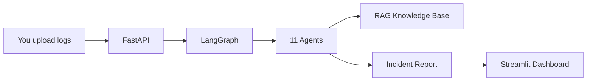

# Mainframe AI Operations Copilot — Step-by-Step Guide

> **Audience:** Mainframe operations engineers, SREs, and architects evaluating agentic AI for z/OS incident response.  
> **Time to complete:** ~30 minutes (setup + first investigation)  
> **Companion video:** See [Video Walkthrough Script](#video-walkthrough-script-5-minutes) at the end of this article.

---

## Table of Contents

1. [What This Copilot Does](#1-what-this-copilot-does)
2. [How It Works](#2-how-it-works)
3. [Prerequisites](#3-prerequisites)
4. [Step 1 — Install and Configure](#4-step-1--install-and-configure)
5. [Step 2 — Generate Sample Data](#5-step-2--generate-sample-data)
6. [Step 3 — Run Automated Tests](#6-step-3--run-automated-tests)
7. [Step 4 — Start the API](#7-step-4--start-the-api)
8. [Step 5 — Run Your First Investigation](#8-step-5--run-your-first-investigation)
9. [Step 6 — Use the Streamlit Dashboard](#9-step-6--use-the-streamlit-dashboard)
10. [Step 7 — Read the Investigation Output](#10-step-7--read-the-investigation-output)
11. [Step 8 — Deploy with Docker (Optional)](#11-step-8--deploy-with-docker-optional)
12. [Troubleshooting](#12-troubleshooting)
13. [Video Walkthrough Script (5 minutes)](#13-video-walkthrough-script-5-minutes)

---

## 1. What This Copilot Does

When a mainframe batch job fails at 2 AM, an experienced operations engineer typically:

1. Opens the **JES log** to find the return code and failing step
2. Reads **SYSOUT** and **ABEND** messages (S0C7, S0C4, U0999…)
3. Checks **JCL** for missing DD cards or GDG issues
4. Reviews the **COBOL program** and **DB2 SQLCODEs**
5. Looks at **scheduler dependencies** (CA-7, Control-M, TWS)
6. Writes an **incident report** and picks a **runbook**

This copilot automates that workflow using **11 specialized AI agents** orchestrated by **LangGraph**. You upload logs; it returns root cause, recovery steps, confidence score, ServiceNow summary, and a runbook recommendation — with **guardrails** that block destructive commands and require human approval before restarts.

---

## 2. How It Works

### Agent pipeline

```
Planner
  → JES Agent          (job name, RC, datasets, security errors)
  → ABEND Agent        (S0C7, S0C4, S806, U0999…)
  → JCL Agent          (DD, DISP, GDG, space errors)
  → COBOL Agent        (program structure, DB2 tables, calls)
  → DB2 Agent          (SQLCODE -911, -913, -805…)
  → MQ Agent           (AMQ9503, channel stopped…)
  → Scheduler Agent    (CA-7, Control-M, dependencies)
  → CICS Agent         (AEI0, APCT, RESP codes)
  → Guardrail Agent    (PII, injection, safety checks)
  → Incident Agent     (full report + ServiceNow)
  → Runbook Agent      (matched operational runbook)
```

### Architecture (high level)



Each agent uses **rule-based parsers** tuned for real z/OS messages (`IEF142I`, `IEC141I`, `SQLCODE=-911`, `AMQ9503E`, etc.). If you configure an OpenAI API key, agents can also use **GPT-4.1** for deeper reasoning. The system works fully offline without an API key.

---

## 3. Prerequisites

| Requirement | Version | Required? |
|-------------|---------|-----------|
| Python | 3.12+ (3.13 recommended) | Yes |
| pip / venv | Latest | Yes |
| Docker & Docker Compose | Latest | Optional |
| OpenAI API key | — | Optional |
| Redis | — | Optional (Docker provides it) |

**Project location:**

```
/Users/premkumargontrand/mainframe_product/mainframe-ai-copilot/
```

---

## 4. Step 1 — Install and Configure

Open a terminal and run:

```bash
cd /Users/premkumargontrand/mainframe_product/mainframe-ai-copilot

# Create isolated Python environment
python3 -m venv .venv
source .venv/bin/activate        # Windows: .venv\Scripts\activate

# Install dependencies
pip install -r requirements.txt

# Create environment file
cp .env.example .env
```

Edit `.env` if needed:

```env
OPENAI_API_KEY=                  # Leave blank for offline/rule-based mode
LOG_LEVEL=INFO
REDIS_ENABLED=false              # Set true when using Docker Redis
REQUIRE_HUMAN_APPROVAL_FOR_RESTART=true
```

**Checkpoint:** `pip list | grep fastapi` should show FastAPI installed.

---

## 5. Step 2 — Generate Sample Data

The repo includes a generator that creates realistic enterprise logs (banking/insurance style):

```bash
python scripts/generate_sample_data.py
```

Verify files were created:

```bash
ls logs/jes/*.log | wc -l       # 25 JES logs
ls logs/abend/*.log | wc -l     # 50 ABEND logs
ls sample_data/cobol/*.cbl | wc -l   # 15 COBOL programs
ls sample_data/jcl/*.jcl | wc -l     # 40+ JCL jobs
ls knowledge/RUNBOOKS/*.md | wc -l   # 11 runbooks
```

**Sample scenario we'll use throughout this guide:**

| Artifact | File |
|----------|------|
| JES log | `logs/jes/jes_CLMDAY01_000.log` |
| ABEND log | `logs/abend/abend_S0C7_000.log` |
| JCL | `sample_data/jcl/CLMDAY01_IDCAMS_000.jcl` |
| COBOL | `sample_data/cobol/PGMCLA00.cbl` |
| DB2 log | `logs/db2/db2_-911_001.log` |
| MQ log | `logs/mq/mq_AMQ9503_000.log` |
| CICS log | `logs/cics/cics_AEI0_000.log` |
| Scheduler | `logs/scheduler/sched_CA7_000.log` |

This simulates a **Claims daily batch (`CLMDAY01`) failing with S0C7** — a very common insurance/banking scenario.

---

## 6. Step 3 — Run Automated Tests

Before manual testing, confirm the codebase is healthy:

```bash
pytest tests/ -v
```

You should see **146 tests passed**. Test layers:

| File | What it covers |
|------|----------------|
| `tests/test_parsers.py` | JES, ABEND, JCL, COBOL, DB2, MQ, CICS log parsing |
| `tests/test_agents.py` | Each agent's analysis output |
| `tests/test_guardrails.py` | PII masking, prompt injection, RAG |
| `tests/test_integration.py` | Full LangGraph flow + REST API |
| `tests/test_performance.py` | Speed + sample log parseability |

With coverage:

```bash
pytest tests/ -v --cov=. --cov-report=term-missing
```

**Checkpoint:** All green before proceeding.

---

## 7. Step 4 — Start the API

```bash
source .venv/bin/activate
uvicorn main:app --reload --port 8000
```

Verify health:

```bash
curl http://localhost:8000/health
```

Expected response:

```json
{
  "status": "healthy",
  "version": "1.0.0",
  "llm_available": false
}
```

Open Swagger UI in your browser: **http://localhost:8000/docs**

Leave this terminal running.

---

## 8. Step 5 — Run Your First Investigation

Open a **second terminal** and run:

```bash
cd /Users/premkumargontrand/mainframe_product/mainframe-ai-copilot
source .venv/bin/activate

curl -s -X POST http://localhost:8000/api/v1/investigate \
  -H "Content-Type: application/json" \
  -d "$(python3 -c "
import json
from pathlib import Path
base = Path('.')
payload = {
    'job_name': 'CLMDAY01',
    'application': 'Claims Processing',
    'description': 'Claims daily batch failed with S0C7 data exception during STEP020',
    'jes_log': (base/'logs/jes/jes_CLMDAY01_000.log').read_text(),
    'abend_log': (base/'logs/abend/abend_S0C7_000.log').read_text(),
    'jcl': (base/'sample_data/jcl/CLMDAY01_IDCAMS_000.jcl').read_text(),
    'cobol_source': (base/'sample_data/cobol/PGMCLA00.cbl').read_text(),
    'db2_log': (base/'logs/db2/db2_-911_001.log').read_text(),
    'mq_log': (base/'logs/mq/mq_AMQ9503_000.log').read_text(),
    'cics_log': (base/'logs/cics/cics_AEI0_000.log').read_text(),
    'scheduler_log': (base/'logs/scheduler/sched_CA7_000.log').read_text(),
}
print(json.dumps(payload))
")" | python3 -m json.tool > investigation_result.json

echo "Report saved to investigation_result.json"
```

### What you should see

| Field | Example value |
|-------|---------------|
| `incident_id` | UUID |
| `status` | `completed` |
| `incident_report.analysis.severity` | `CRITICAL` |
| `incident_report.analysis.root_cause` | `S0C7: Invalid decimal data…` |
| `incident_report.analysis.affected_job` | `CLMDAY01` |
| `runbook.analysis.runbook_id` | `RB-ABEND-S0C7` |
| `guardrail.analysis.requires_human_approval` | `true` (restart recommended) |
| `agent_results` | 11+ entries |

### Other API calls to try

```bash
# Investigation history
curl http://localhost:8000/api/v1/history?limit=5 | python3 -m json.tool

# Search knowledge base
curl "http://localhost:8000/api/v1/knowledge/search?query=S0C7&top_k=3" | python3 -m json.tool

# Upload files directly
curl -X POST http://localhost:8000/api/v1/investigate/upload \
  -F "job_name=CLMDAY01" \
  -F "application=Claims Processing" \
  -F "jes_log=@logs/jes/jes_CLMDAY01_000.log" \
  -F "abend_log=@logs/abend/abend_S0C7_000.log"
```

---

## 9. Step 6 — Use the Streamlit Dashboard

In a **third terminal**:

```bash
cd /Users/premkumargontrand/mainframe_product/mainframe-ai-copilot
source .venv/bin/activate
streamlit run dashboard/app.py
```

Open **http://localhost:8501**

### Dashboard walkthrough

1. **Sidebar** — Enter Job Name `CLMDAY01`, Application `Claims Processing`, and a short description.
2. **Upload** — Drag and drop:
   - JES log → `logs/jes/jes_CLMDAY01_000.log`
   - ABEND log → `logs/abend/abend_S0C7_000.log`
   - JCL, COBOL, DB2, MQ, CICS, Scheduler logs (optional but recommended)
3. **Click** "Run AI Investigation"
4. **Review tabs:**
   - **Root Cause** — S0C7 explanation and recovery actions
   - **Timeline** — JES → ABEND → Scheduler events
   - **Agents** — Confidence bar chart per agent
   - **Runbook** — Step-by-step recovery procedure
   - **Report** — Executive summary + JSON download

If the API is not running, the dashboard automatically falls back to local LangGraph execution.

---

## 10. Step 7 — Read the Investigation Output

Every investigation produces a structured report. Here is what each section means for operations:

### Severity

| Level | Meaning |
|-------|---------|
| `CRITICAL` | S0C4, S0C7, U0999 — SLA at risk, dependents blocked |
| `HIGH` | DB2 -904, deadlocks, MQ channel down |
| `MEDIUM` | RC 8–11, missing datasets |
| `LOW` | Informational or minor issues |

### Confidence score

Aggregated from all agents (0.0–1.0). Below `0.65` (configurable), the guardrail adds a warning. Always treat low-confidence results as **draft** — validate against raw logs.

### Recovery actions

Each action may flag `requires_approval: true`. This is intentional: the copilot will **not** auto-recommend destructive restarts without human sign-off.

### ServiceNow summary

Ready-to-paste JSON with short description, priority, assignment group, and work notes.

### Runbook

Matched from `knowledge/RUNBOOKS/` — e.g. `RB-ABEND-S0C7` for data exceptions.

---

## 11. Step 8 — Deploy with Docker (Optional)

For a production-like stack (API + Dashboard + Redis + Prometheus + Grafana):

```bash
cd /Users/premkumargontrand/mainframe_product/mainframe-ai-copilot
docker-compose up -d --build
```

| Service | URL |
|---------|-----|
| API | http://localhost:8000 |
| Swagger | http://localhost:8000/docs |
| Dashboard | http://localhost:8501 |
| Prometheus | http://localhost:9090 |
| Grafana | http://localhost:3000 (admin / admin) |

```bash
curl http://localhost:8000/health
docker-compose logs -f api
docker-compose down    # when finished
```

---

## 12. Troubleshooting

| Symptom | Cause | Fix |
|---------|-------|-----|
| `Redis unavailable` in logs | Redis not running locally | Set `REDIS_ENABLED=false` in `.env`, or use Docker Compose |
| `Vector index unavailable` | HuggingFace model can't download | Normal offline — keyword RAG still works |
| `llm_available: false` | No OpenAI key | Add `OPENAI_API_KEY` to `.env` (optional) |
| Port 8000 in use | Another process | `uvicorn main:app --port 8001` |
| Dashboard can't reach API | Wrong URL | Set API URL in sidebar to `http://localhost:8000/api/v1` |
| Missing sample files | Generator not run | `python scripts/generate_sample_data.py` |
| pytest failures | Stale DB lock | `rm -rf data/*.duckdb data/*.sqlite` and re-run |

---

## 13. Video Walkthrough Script (5 minutes)

Use this script to record a short explainer video. Suggested tools: OBS Studio, Loom, or QuickTime screen recording.

### Video metadata

| Field | Value |
|-------|-------|
| **Title** | Mainframe AI Copilot — Investigate a Production ABEND in 5 Minutes |
| **Duration** | ~5 minutes |
| **Audience** | Mainframe ops engineers, architects |
| **Thumbnail text** | "S0C7 → Root Cause → Runbook" |

---

### Scene 1 — Hook (0:00 – 0:30)

**[Screen: JES log with S0C7 highlighted]**

> "It's 2 AM. Job CLMDAY01 — your claims daily batch — just abended with S0C7. You need root cause, recovery steps, and a ServiceNow ticket before the SLA window closes. Let me show you how the Mainframe AI Operations Copilot does that in under a minute."

---

### Scene 2 — What it is (0:30 – 1:15)

**[Screen: Architecture diagram from README or slide]**

> "This is an agentic AI system built with LangGraph and FastAPI. Eleven specialized agents analyze your JES logs, ABENDs, JCL, COBOL, DB2, MQ, CICS, and scheduler output — the same artifacts you'd review manually. A guardrail agent enforces safety: no destructive commands, PII masking, and human approval before restarts."

**[Screen: Agent pipeline text]**

```
Planner → JES → ABEND → JCL → COBOL → DB2 → MQ → Scheduler → CICS
  → Guardrail → Incident Report → Runbook
```

---

### Scene 3 — Quick setup (1:15 – 2:00)

**[Screen: Terminal]**

> "Setup takes about two minutes."

```bash
cd mainframe-ai-copilot
python3 -m venv .venv && source .venv/bin/activate
pip install -r requirements.txt
python scripts/generate_sample_data.py
uvicorn main:app --reload --port 8000
```

> "We generate realistic sample logs — 25 JES files, 50 ABENDs, COBOL, JCL — modeled after banking and insurance production environments."

---

### Scene 4 — Run investigation via API (2:00 – 3:15)

**[Screen: Terminal with curl, then JSON output]**

> "I'll POST a full incident — JES, ABEND, JCL, COBOL, DB2, MQ, CICS, and scheduler logs — for job CLMDAY01."

Run the curl command from [Step 5](#8-step-5--run-your-first-investigation).

**[Screen: Scroll through JSON response]**

> "In seconds we get:
> - Severity: CRITICAL
> - Root cause: S0C7 data exception — invalid packed decimal
> - Recovery: validate input file, find failing record via offset
> - Runbook: RB-ABEND-S0C7
> - Guardrail: human approval required before restart
> - ServiceNow summary ready to paste"

---

### Scene 5 — Dashboard demo (3:15 – 4:15)

**[Screen: Streamlit at localhost:8501]**

> "For day-to-day use, ops teams use the Streamlit dashboard."

1. Show sidebar — job name, application
2. Upload JES + ABEND files
3. Click "Run AI Investigation"
4. Show Root Cause tab
5. Show Agent confidence chart
6. Show Runbook tab
7. Click "Download JSON Report"

> "No API key required — the rule-based engine handles standard z/OS messages out of the box. Add OpenAI GPT-4.1 for deeper reasoning when you need it."

---

### Scene 6 — Tests and wrap-up (4:15 – 5:00)

**[Screen: Terminal — pytest output]**

```bash
pytest tests/ -v
# 146 passed
```

> "The project ships with 146 automated tests — parsers, agents, guardrails, integration, and performance. Clone the repo, run pytest, upload your own logs, and you're production-ready."

**[Screen: Title card]**

> "Mainframe AI Operations Copilot — autonomous incident investigation for z/OS. Link to the full step-by-step guide in the description."

---

### Video production checklist

- [ ] Record terminal at 14pt+ font, dark theme
- [ ] Record browser at 1280×720 minimum
- [ ] Blur or use sample data only (no real PII)
- [ ] Add captions for ABEND codes (S0C7, etc.)
- [ ] Link to `docs/STEP-BY-STEP-GUIDE.md` in video description
- [ ] Link to GitHub repo and Swagger docs (`/docs`)

### Suggested video description (copy-paste)

```
Mainframe AI Operations Copilot — investigate z/OS batch failures with agentic AI.

In this walkthrough we:
✅ Set up the copilot locally
✅ Upload JES + ABEND logs for job CLMDAY01 (S0C7)
✅ Get root cause, recovery steps, runbook, and ServiceNow summary
✅ Demo the Streamlit dashboard

Tech stack: LangGraph, FastAPI, Python, Streamlit, FAISS RAG

📖 Full step-by-step guide: docs/STEP-BY-STEP-GUIDE.md
🔗 API docs: http://localhost:8000/docs

#mainframe #zos #ai #langgraph #devops
```

---

## Related documentation

- [README](../README.md) — Architecture, API reference, configuration
- [`.env.example`](../.env.example) — Environment variables
- [`prompts/templates.py`](../prompts/templates.py) — LLM prompt templates
- [`knowledge/RUNBOOKS/`](../knowledge/RUNBOOKS/) — Operational runbooks

---

*Last updated: June 2026*
